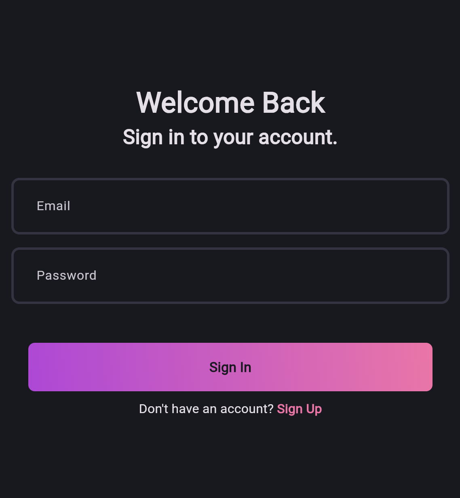
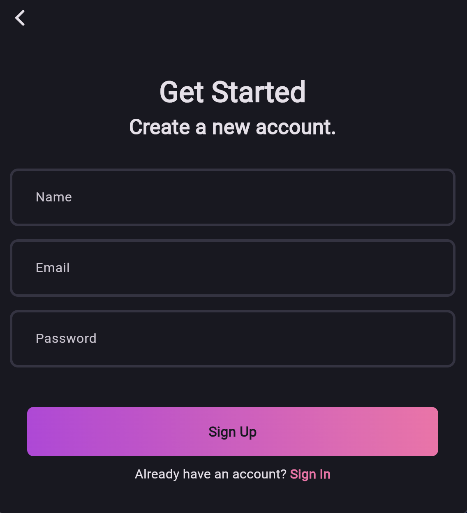
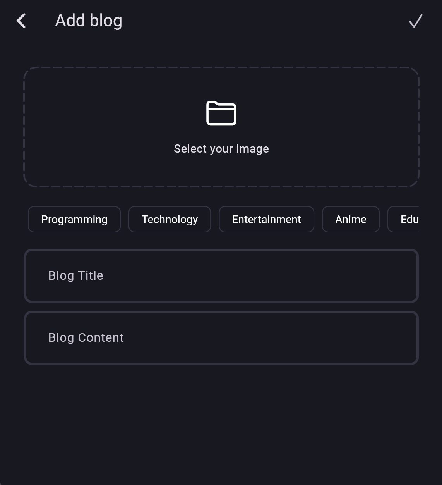
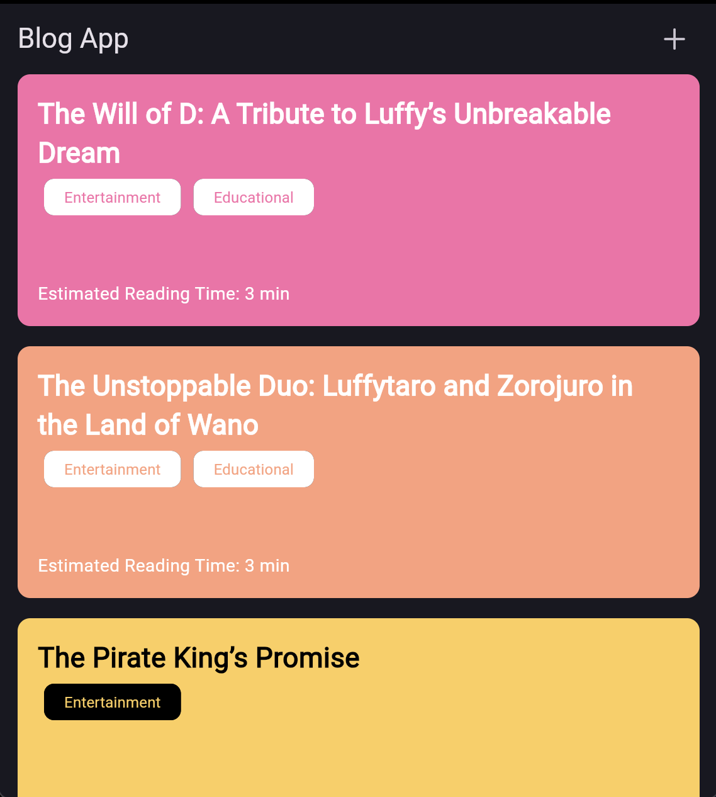

# BlogApp

A **feature-complete blogging application** built with **Flutter**, implementing **authentication, CRUD operations, offline-first caching**, and clean separation of concerns.

This project focuses on **real product workflows** rather than UI-only demonstrations.

---

## 📸 Screenshots

| Login | Registration | Create Blog |
|------|------|-----------|
|  |  |  |

| Blog Details | Home Page |
|-------------|-------------|
|  |  |

## 🚀 Key Features

- 🔐 **Authentication**
  - Secure user sign-in / sign-up
  - Session handling and protected routes

- 📝 **Blog Management (CRUD)**
  - Create blog posts
  - Edit existing posts
  - Delete posts
  - View blog list and detailed blog pages

- 🌐 **Backend Integration**
  - REST API communication
  - Proper request / response handling
  - Error and loading state management

- 📡 **Offline-First Support**
  - Local caching of blog data
  - Seamless access during network loss
  - Data synchronization when connectivity is restored

- 📱 **Multi-Screen UI**
  - Blog listing screen
  - Blog detail screen
  - Create / Edit blog screen
  - Authentication screens
  - Clean navigation flow

- 🧠 **State-Driven UI**
  - UI reacts to data changes
  - Handles loading, empty, and error states gracefully

---

## 🏗 Architecture Overview

The app follows a **layered Flutter architecture** focused on maintainability and scalability.
```markdown
lib/
├── core/
│ ├── network/
│ ├── storage/
│ ├── utils/
│ └── constants/
├── features/
│ ├── auth/
│ ├── blogs/
│ └── profile/
└── main.dart
```

### Architecture Principles
- Clear separation of UI, logic, and data
- Repository pattern for data sources
- Offline-first mindset

---

## 🛠 Tech Stack

- **Flutter / Dart**
- **Networking**: REST APIs
- **Local Storage**: Offline caching mechanism
- **State Management**: Reactive UI state handling
- **Architecture**: Layered / Feature-based structure

---

## ▶️ Getting Started

```bash
flutter pub get
flutter run
```
